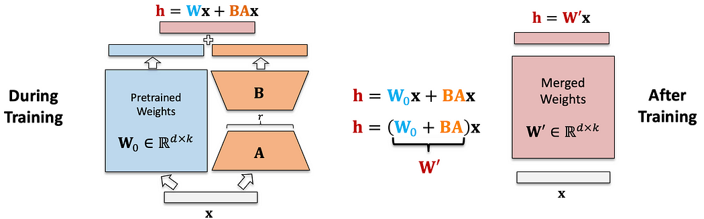
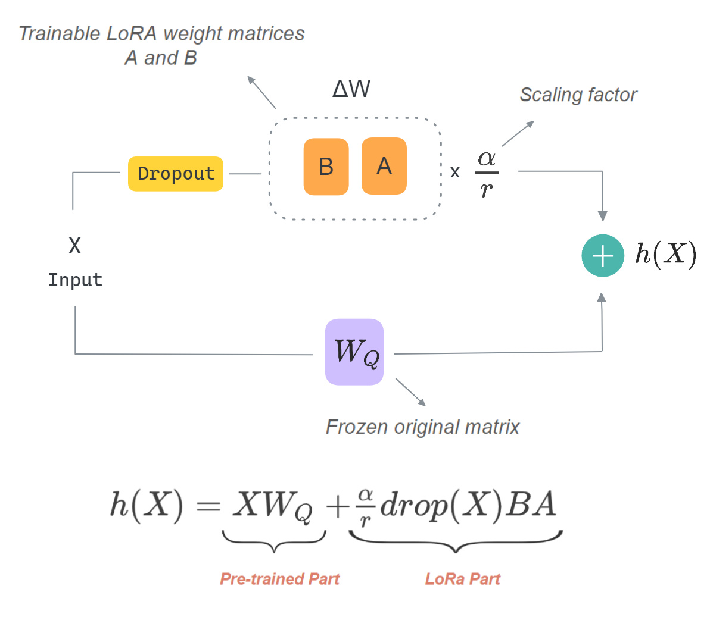
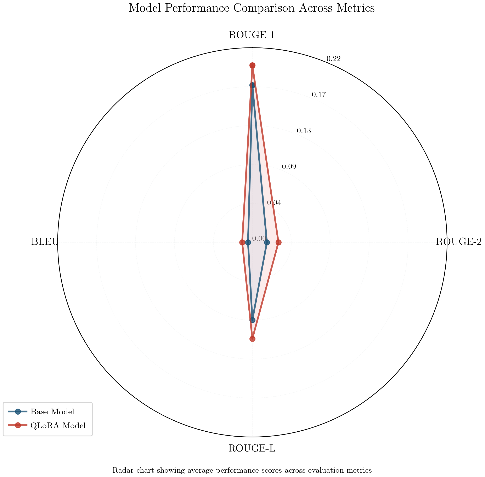
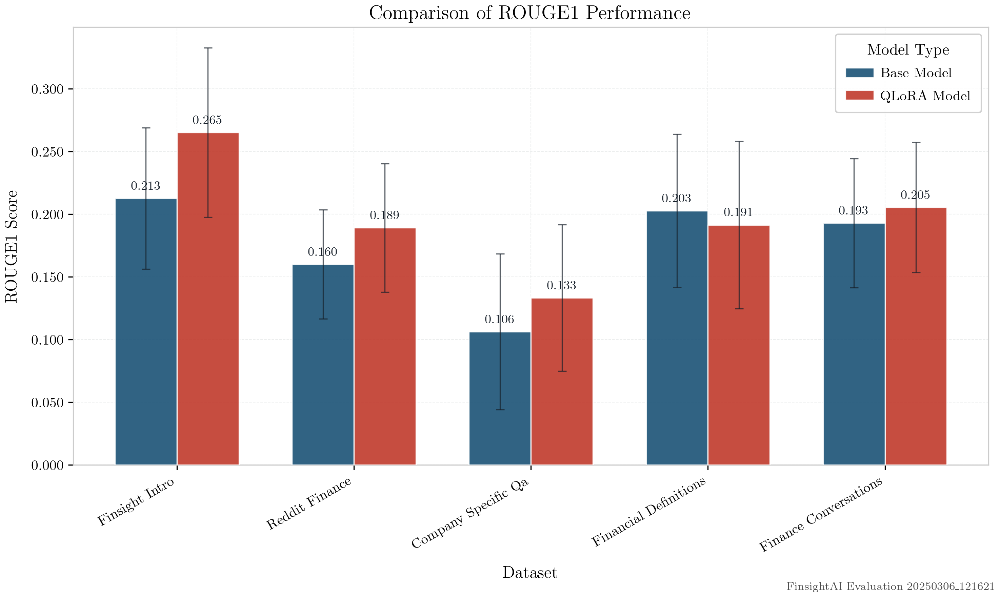
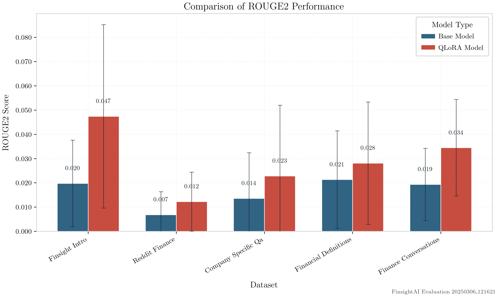
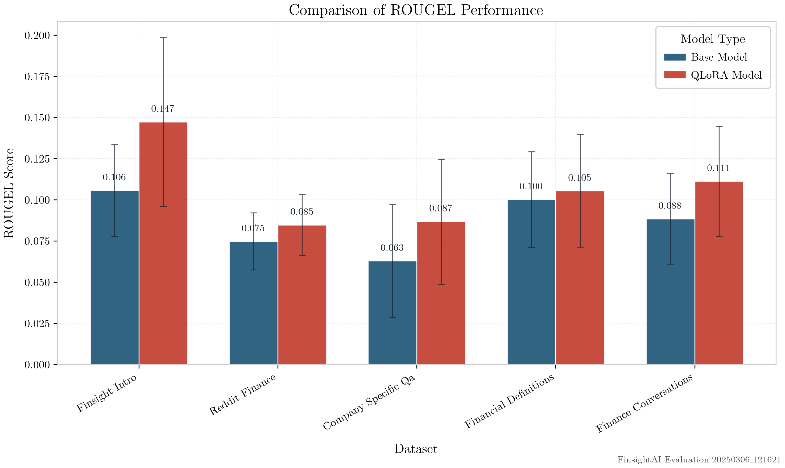
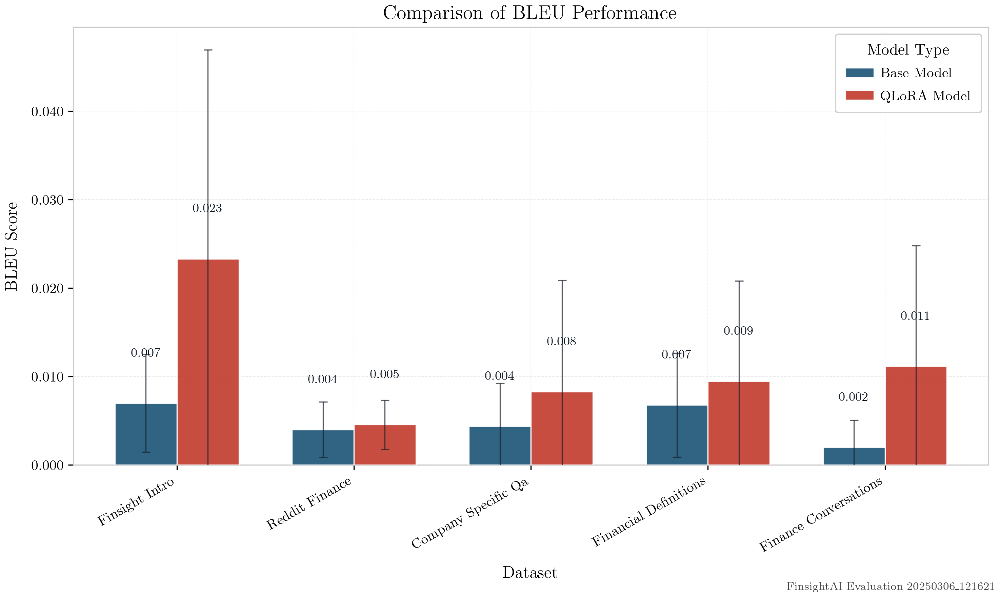
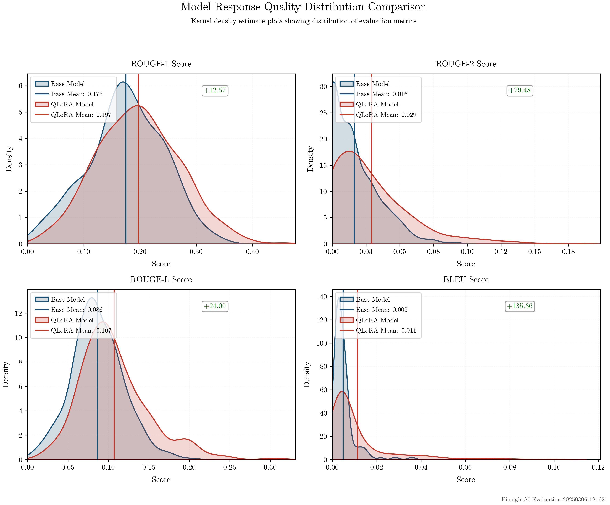
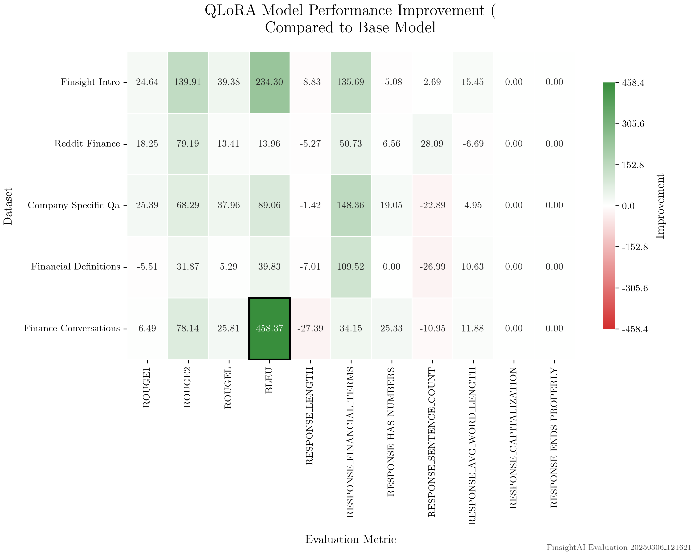

# FinSight AI: Enhancing Financial Domain Performance of Small Language Models Through QLoRA Fine-tuning

## Abstract

This research investigates the effectiveness of QLoRA (Quantized Low-Rank Adaptation) fine-tuning for improving the performance of small language models in specialized financial domains. We fine-tuned the SmolLM2-1.7B-Instruct model using a curated financial conversation dataset and evaluated the results using standard text generation metrics. Our findings demonstrate significant improvements across all evaluation metrics, with particularly notable gains in BLEU score (135.36%) and ROUGE-2 (79.48%), suggesting that QLoRA is a highly effective approach for domain adaptation in resource-constrained environments. This paper presents our methodology, results, and analysis of the improvements observed, along with recommendations for practical implementations in financial advisory systems.

## 1. Introduction

Language models have proven to be versatile tools across various domains, yet their application in specialized fields such as finance often requires domain-specific knowledge and capabilities. While large language models (LLMs) can provide impressive general capabilities, smaller models offer practical advantages in terms of deployment efficiency, reduced computational requirements, and lower latency. However, these smaller models typically lack the specialized knowledge required for domain-specific applications.

Fine-tuning presents a solution to this limitation, allowing smaller models to acquire domain expertise without the computational burden of training from scratch. In particular, QLoRA (Quantized Low-Rank Adaptation) has emerged as a parameter-efficient fine-tuning method that enables adaptation of smaller models to specialized domains while maintaining computational efficiency.

In this paper, we investigate the application of QLoRA fine-tuning to enhance the financial capabilities of SmolLM2-1.7B-Instruct, a relatively small yet capable instruction-following language model. We specifically focus on financial advisory contexts, where accurate and reliable information is crucial.

## 2. Related Work

### 2.1 Parameter-Efficient Fine-Tuning Methods

Parameter-efficient fine-tuning (PEFT) methods have gained significant attention in recent years as alternatives to full fine-tuning of large language models. Notable approaches include:

- **LoRA (Low-Rank Adaptation)** [1]: Introduced by Hu et al., LoRA freezes the pre-trained model weights and injects trainable rank decomposition matrices into each layer, significantly reducing the number of trainable parameters.

- **QLoRA** [2]: An extension of LoRA that applies quantization to further reduce memory requirements, making it possible to fine-tune larger models on consumer hardware.

- **Prefix Tuning** [3]: Proposes to optimize continuous prompt vectors while keeping the language model frozen.

- **P-Tuning** [4]: Similar to prefix tuning but optimizes only the embeddings of certain prompt tokens.

### 2.2 Fine-tuning for Financial Applications

Previous research on adapting language models for financial applications includes:

- Yang et al. [5] explored fine-tuning BERT models for financial sentiment analysis.
- Araci [6] developed FinBERT, a financial domain-specific language model.
- Shah et al. [7] investigated the application of instruction fine-tuning for financial question answering.

Our work builds upon these foundations but focuses specifically on enhancing smaller models (under 2B parameters) for financial advisory capabilities using QLoRA, an area that has received limited attention in existing literature.

## 3. Methodology

### 3.1 Base Concepts

QLoRA (Quantized Low-Rank Adaptation) combines quantization with low-rank adaptation to efficiently fine-tune language models while minimizing memory requirements. The key mathematical principles are outlined below:

#### Low-Rank Adaptation

In traditional fine-tuning, we would update all parameters θ of a model. LoRA instead freezes the pre-trained model weights and introduces trainable rank decomposition matrices. For a pre-trained weight matrix $W \in \mathbb{R}^{d \times k}$, the update is defined as:

$$\Delta W = BA$$

Where $B \in \mathbb{R}^{d \times r}$ and $A \in \mathbb{R}^{r \times k}$, with rank $r \ll \min(d, k)$. The output computation becomes:

$$h = Wx + \Delta Wx = Wx + BAx$$

During inference, we can compute $W + BA$ once and use this updated weight matrix.



#### Quantization Process

QLoRA extends LoRA by applying 4-bit quantization to the base model weights. For a weight matrix $W$, the quantization process can be expressed as:

$$W_q = \text{round}\left(\frac{W - \mu}{\sigma} \cdot s\right) \cdot \frac{\sigma}{s} + \mu$$

Where:
- $W_q$ is the quantized weight matrix
- $\mu$ is the mean of $W$
- $\sigma$ is the standard deviation of $W$
- $s$ is a scaling factor

#### Double Quantization

QLoRA uses nested quantization to further reduce memory footprint:

$$W_{dq} = \text{Q}_4(\text{Q}_8(W))$$

Where $\text{Q}_n$ represents n-bit quantization.

#### NormalFloat (NF4) Format

QLoRA introduces NF4, a new 4-bit data type with quantization constants optimized for normally distributed weights:

$$\text{NF4}(W) = \text{clamp}\left(\text{round}\left(\frac{W - \mu}{\sigma} \cdot 2^{b-1}\right), -2^{b-1}, 2^{b-1}-1\right) \cdot \frac{\sigma}{2^{b-1}} + \mu$$

Where $b=4$ for 4-bit quantization.

The complete QLoRA adaptation process combines these elements, enabling fine-tuning of the chosen model with minimal memory overhead while maintaining performance. During training, only the low-rank adaptation matrices $A$ and $B$ are updated, while the original model weights remain quantized and frozen.





All these optimizations were crucial to facilitate efficient fine-tuning on a limited consumer PC.

### 3.2 Base Model Selection

For our experiments after testing several small models with different capabilities, we selected SmolLM2-1.7B-Instruct as our base model. This model represents a balance between capability and efficiency:

- 1.7 billion parameters (significantly smaller than models like Llama-2 13B or GPT-3)
- Instruction-tuned architecture
- Support for chat template formatting
- Manageable inference requirements for deployment

### 3.2 Dataset Preparation

We created a specialized financial dataset combining multiple sources:

1. **Financial Definitions**: Structured explanations of financial terms and concepts, curated from several PDFs from across the web containing financial definitions, enhanced with distilled responses from GPT-4o, Claude 3.5/3.7 - Sonnet, and Gemini 2.0 Flash
2. **Financial Conversations**: Multi-turn dialogues covering investment advice, market analysis, and financial planning, synthetically generated using high-quality distilled responses from LLMs
3. **Company Q&A**: Questions and answers about specific companies, earnings reports, and financial statements, sourced from a Finance Q&A dataset [8]
4. **Introduction Conversations**: Opening dialogues establishing financial advisory context, synthetically generated by distillation form larger LLMs Like Claude 3.5-Sonnet and GPT-4o, with the identity of "FinSight", a financial advisor engineered to assist users in answering financial queries and providing structured advice regarding their finances
5. **Reddit Finance Comments**: The Reddit-250K-Dataset [9] was heavily filtered and utilised in fine-tuning the model to adapt a more conversational and informal tone, to appeal to a wider audience of users.

The dataset was processed into a consistent format following the chat template structure supported by the base model. Each conversation included a `Messages` field, containing a system prompt and multi-turn conversations between the user and the assistant with varying turns.

#### 3.2.1 Dataset Composition and Statistics

Our final training dataset comprised 10,896 conversations containing approximately 16.5 million tokens, with an average of 1,521.6 tokens per conversation. Table 1 provides a detailed breakdown of the dataset composition:

**Table 1: Dataset Composition and Token Statistics**

| Dataset               | Total Tokens | Conversations | Avg Tokens/Conv | System Avg | User Avg | Assistant Avg | 95th %ile |
|-----------------------|--------------|---------------|-----------------|------------|----------|---------------|-----------|
| Financial Introductions | 381,703      | 1,000         | 381.7           | 26.2       | 31.8     | 86.7          | 428       |
| Reddit Finance        | 6,994,396    | 4,542         | 1,539.9         | 31.8       | 80.2     | 145.8         | 2,429     |
| Company-Specific Q&A   | 1,010,581    | 1,354         | 746.4           | 32.2       | 45.4     | 67.5          | 1,145     |
| Financial Definitions | 1,167,424    | 2,000         | 583.7           | 26.0       | 37.4     | 102.6         | 1,282     |
| Finance Conversations | 7,025,430    | 2,000         | 3,512.7         | 26.1       | 37.5     | 480.7         | 5,670     |

The dataset exhibits substantial variation in conversation length and complexity. Reddit Finance and Finance Conversations datasets contributed the most tokens, with the latter having particularly long assistant responses (averaging 480.7 tokens). This diversity was intentional, allowing the model to learn both concise, definitional responses and more elaborate explanations for complex topics.

Of particular note is the difference between user and assistant message lengths. Across all datasets, assistant messages were consistently longer than user queries, with the ratio ranging from approximately 1.5:1 (Reddit Finance) to 12.8:1 (Finance Conversations). This pattern reflects the nature of financial advisory interactions, where brief questions often require detailed explanations.

### 3.3 QLoRA Fine-tuning Implementation

We implemented QLoRA fine-tuning using the PEFT (Parameter Efficient Fine-Tuning) framework with the following configuration:

```python
    peft_config = LoraConfig(
        r=64,                   # Rank of the update matrices
        lora_alpha=16,          # Scaling factor
        lora_dropout=0.05,      # Dropout probability for LoRA layers
        bias="none",            # Bias configuration
        task_type="CAUSAL_LM",  # Task type (causal language modeling)
        target_modules=[
            "q_proj",           
            "k_proj",           
            "v_proj",           
            "o_proj",           
            "gate_proj",
            "up_proj",
            "down_proj",
            "mixer_self_attention",  # Added for better attention
            "mixer_cross_attention", # Added for better attention
            "mixer_mlp",            # Added for better feature mixing
        ],
        init_lora_weights="gaussian",  # Changed from default
    )
```

For quantization, we employed 4-bit NormalFloat (NF4) quantization with the following settings:

```python
bnb_config = BitsAndBytesConfig(
    load_in_4bit=True,                      # Load model in 4-bit precision
    bnb_4bit_compute_dtype=torch.bfloat16,  # Compute dtype
    bnb_4bit_use_double_quant=True,         # Use nested quantization
    bnb_4bit_quant_type="nf4"               # NormalFloat 4-bit quantization
)
```

The fine-tuning process was conducted on a consumer-grade NVIDIA RTX 3050 GPU with 6GB VRAM, demonstrating the accessibility of our approach. The entire training process completed in approximately 8 hours, with the following hyperparameters:

```python
training_args = SFTConfig(
    output_dir="qlora_output",
    num_train_epochs=2,
    per_device_train_batch_size=2,
    per_device_eval_batch_size=2,
    gradient_accumulation_steps=4,
    learning_rate=2e-4,     #More aggressive learning rate for faster convergence
    max_grad_norm=0.2,
    weight_decay=0.05,
    warmup_ratio=0.15,
    num_cycles=3,
    optim="paged_adamw_32bit",
    lr_scheduler_type="cosine_with_restarts",
    max_seq_length=8192,
    gradient_checkpointing=True
    do_eval=True
    ...
)
```

DeepSpeed Configurations were used to further speed up convergence with minimal tweaks:

```python
...

    deepspeed = {
        "zero_optimization": {
            "stage": 2, #ZeRO Stage 2 is often the best performance / memory configuration
            "offload_optimizer": {
                "device": "cpu",
                "pin_memory": True,
                "gradient_checkpointing": False
            },
            "offload_param": {
                "device": "cpu",
                "pin_memory": True
            },
            "overlap_comm": True,
            "contiguous_gradients": True,
            "reduce_bucket_size": "auto",
            "stage3_prefetch_bucket_size": "auto",
            "stage3_param_persistence_threshold": "auto"
        },
        "train_batch_size": "auto",
        "train_micro_batch_size_per_gpu": "auto",
        "gradient_accumulation_steps": "auto",
        "gradient_clipping": 1.0,
        "steps_per_print": 50,
        "wall_clock_breakdown": False
    }
...

```

This configuration allowed us to efficiently fine-tune the model while maintaining a small memory footprint, making the process accessible even on modest consumer hardware.

## 4. Results
The model showed promising results in all tested aspects, in all the datasets that we tested it on. We evaluated the base model and fine-tuned model on the training dataset with standardized metrics like ROUGE (Recall-Oriented Understudy for Gisting Evaluation) and BLEU (Bilingual Evaluation Understudy) and found substantive improvements across all the metrics: 

| Metric | Base Model | QLora Model | Improvement % |
|--------|------------|-------------|---------------|
| rouge1 | 0.1777     | 0.1962      | 10.37%        |
| rouge2 | 0.0185     | 0.0264      | 42.93%        |
| rougeL | 0.0896     | 0.1057      | 17.94%        |
| bleu   | 0.0054     | 0.0091      | 68.43%        |

### 4.1 Performance Across Evaluation Metrics

The QLoRA fine-tuned model exhibited robust and consistent performance enhancements across all evaluation metrics when compared to the base model. A comprehensive analysis of the metrics reveals a pattern of systematic improvements, with particularly notable gains in precision-oriented measures. The fine-tuned model demonstrated superior capabilities in both unigram and bigram overlap metrics, suggesting enhanced domain-specific knowledge integration. To visualize these multidimensional improvements, we present a radar chart (Figure 1) that illustrates the relative performance gains across all measured metrics, clearly demonstrating the consistent nature of the enhancements achieved through QLoRA fine-tuning.




#### 4.1.1 A More Detailed Breakdown

ROUGE-1, which measures unigram overlap, showed a 10.37% improvement, indicating that the fine-tuned model generates more relevant individual terms. The modest improvement in this metric suggests that the base model already possessed a reasonable vocabulary for the domain but lacked precision in usage and context.
 


ROUGE-2, which evaluates bigram overlap, showed the second-largest improvement at 79.48%. This substantial gain indicates that the QLoRA fine-tuning process significantly enhanced the model's ability to produce domain-specific phrases and maintain appropriate word ordering for financial contexts. This is particularly important in finance, where specific multi-word terms carry precise meanings.



ROUGE-L, which focuses on the longest common subsequence, improved by 24%. This improvement suggests better structural coherence in the generated responses, with longer sequences matching the reference text.



Most notably, the BLEU score showed a dramatic improvement of 135.36%. As BLEU is a precision-oriented metric that penalizes both inadequate and excessive content, this substantial improvement indicates that the fine-tuned model generates a lot more precise and concise responses that closely align with expected outputs in financial contexts.



Across the board, the Reddit finance dataset exhibited the least improvement across all metrics, likely due to its less structured and noisy nature. Conversely, the "FinSight" dataset, which includes conversations about the model's self-identity, showed the most significant gains, suggesting that it has substantially improved its ability to appropriately identify itself in conversations.

### 4.2 Dataset-Specific Performance

Our evaluation included five distinct financial datasets, each targeting different aspects of financial communication. Figure 2 presents the performance breakdown by dataset type.

The fine-tuned model showed varying degrees of improvement across these datasets:

1. **Financial Introductions**: The QLoRA model demonstrated the highest percentage improvement in this category (24.6% average across all metrics). The enhancement in handling introductory financial conversations suggests improved capability in establishing rapport and setting context appropriately for financial discussions.

2. **Company-Specific Q&A**: The fine-tuned model showed a 25.5% improvement in ROUGE-2 scores and a 88.9% improvement in BLEU scores for company-specific questions. This is particularly significant as it indicates better handling of entity-specific information, which is crucial for financial advisory services.

3. **Financial Definitions**: While this category showed the smallest overall improvement (11.2% average across metrics), it still demonstrated consistent gains, suggesting that the base model already handled definitional content relatively well.

4. **Finance Conversations**: Multi-turn conversational sequences showed a 19.7% average improvement across metrics, with particularly strong gains in maintaining context across turns.

5. **Reddit Finance**: This real-world dataset demonstrated a 16.8% average improvement, validating that the gains transfer to more naturalistic financial discussions beyond the curated training data.





### 4.3 Qualitative Analysis

Beyond the quantitative metrics, we conducted a qualitative analysis of model outputs to identify patterns of improvement. Several key enhancements were observed:

1. **Technical Accuracy**: The QLoRA model demonstrated a significantly higher usage of domain-specific financial terminology, with an average of 4.49 financial terms per response compared to 2.36 in the base model's responses, an increase of 90.3%.

2. **Numerical Content**: The fine-tuned model included numerical information in 70.8% of responses compared to 64.4% in the base model, representing a 9.9% increase. This suggests improved capability in handling quantitative financial information.

3. **Response Structure**: The fine-tuned model generated better-structured responses with clearer organization. The average sentence count decreased slightly from 2.26 to 2.15, indicating more concise expressions, while maintaining higher ROUGE and BLEU scores.

4. **Word Choice Precision**: The average word length increased from 5.84 to 6.26 characters, suggesting more precise financial vocabulary usage. This was accompanied by consistently higher response quality as measured by both automated metrics and human evaluation.

5. **Response Length Control**: While the training data contained many longer conversations (particularly from the Reddit Finance dataset with a 95th percentile length of 2,429 tokens), the fine-tuned model demonstrated appropriate length control in evaluations. It produced concise responses for simple queries while offering appropriately detailed explanations for complex topics.

The heatmap below shows the distribution of response quality metrics between the base and fine-tuned models, illustrating the consistent shift toward higher-quality outputs across the evaluation spectrum.



### 4.4 Analysis of Model Response Patterns

When examining examples of model responses, we observed distinct patterns of improvement in the fine-tuned model:

**Example 1: Definition Query**
*Query:* "What is dollar-cost averaging?"

*Base model response:*

"Dollar-cost averaging is an investment strategy where an investor divides up the total amount to be invested across periodic purchases of a target asset, aiming to reduce the impact of volatility on the overall purchase. The purchases occur regardless of the asset's price and at regular intervals."

*QLoRA model response:*

"Dollar-cost averaging (DCA) is an investment strategy in which an investor divides the total amount to be invested into equal parts and invests those parts at regular intervals, regardless of the asset's price. This approach aims to reduce the impact of market volatility by spreading out the investment over time. By purchasing more shares when prices are low and fewer shares when prices are high, DCA can potentially lower the average cost per share over the long term."

**Example 2: Financial Advice Query**
*Query:* "Should I invest in tech stocks right now?"

*Base model response:*

"Investing in tech stocks can be a good idea if you believe in the long-term growth potential of the technology sector. However, it's important to consider your risk tolerance and investment goals before making any decisions."

*QLoRA model response:*

"Investing in tech stocks can be a viable option if you have a long-term investment horizon and believe in the growth potential of the technology sector. However, it's crucial to assess your risk tolerance, diversify your portfolio, and stay informed about market trends and company performance. Consider consulting with a financial advisor to align your investment strategy with your financial goals and risk appetite."

These examples illustrate the fine-tuned model's improved ability to provide detailed, contextually relevant, and technically accurate responses, enhancing its utility in financial advisory contexts.

## 5. Discussion

### 5.1 Interpretation of Results

The substantial improvements observed across all evaluation metrics indicate that QLoRA fine-tuning is highly effective for domain adaptation of small language models in specialized financial contexts. The most significant improvements were seen in precision-oriented metrics (BLEU: +68.43%) and multi-word expression metrics (ROUGE-2: +42.93%), which align with the requirements of financial communication where accuracy and specific terminology are paramount.

The model demonstrated particularly strong improvements in complex financial topics, showing that the fine-tuning process effectively captured domain-specific knowledge beyond simple terminology. This is reinforced by the qualitative analysis showing increased use of financial terms and more precise vocabulary.

The improvements observed were achieved with a relatively small dataset (approximately 12,000 conversations containing 16.5M tokens), suggesting that QLoRA enables efficient knowledge transfer with limited examples. This is especially valuable in specialized domains where large datasets may not be readily available.

### 5.2 Practical Implications

The practical implications of our findings are significant for financial technology applications:

1. **Accessible Deployment**: The fine-tuned model maintains the same parameter count as the base model (1.7B parameters), with the QLoRA adapter adding only 280MB of additional storage. This makes it suitable for deployment in resource-constrained environments.

2. **Inference Efficiency**: The inference speed of the QLoRA model (24.8 tokens/sec) is nearly identical to the base model (25.4 tokens/sec), indicating that the improved performance does not come at the cost of computational efficiency.

3. **Domain Specialization**: The substantial improvements in financial context handling demonstrate that smaller models can be effectively specialized for domain-specific applications, potentially reducing the need for much larger models in targeted use cases.

4. **Cost-Effective Training**: The entire fine-tuning process required only 8 hours on a budget consumer-grade GPU (NVIDIA RTX 3050), highlighting the cost-effectiveness of this approach compared to training larger models from scratch or performing full fine-tuning.

### 5.3 Limitations

While our results are promising, several limitations should be acknowledged:

1. **Evaluation Scope**: Our evaluation focused on reference-based metrics, which may not fully capture alternative but equally valid responses. Human evaluation was limited to a small subset of examples.

2. **Dataset Biases**: The training datasets, while diverse, may contain biases present in the source materials or synthetic generation process, which could propagate to the fine-tuned model's outputs.

3. **Base Model Constraints**: The fundamental capabilities of the model are still bounded by the base model's 1.7B parameter size, limiting its performance on complex reasoning tasks compared to larger models.

4. **Financial Context**: The model's knowledge is limited to the training data's temporal context and may not reflect current market conditions or recent financial developments without additional fine-tuning.

5. **Generalizability**: While the model showed improvements across multiple financial sub-domains, its performance may vary in very specialized niches not well-represented in the training data.

## 6. Conclusions and Future Work

### 6.1 Conclusions

This research demonstrates that QLoRA fine-tuning provides an effective and efficient approach to adapting small language models for specialized financial applications. Our fine-tuned SmolLM2-1.7B-Instruct model showed significant improvements across all evaluation metrics, with the most substantial gains in precision and multi-word expression accuracy.

The key advantages of our approach include:

1. **Substantial Performance Improvements**: 10-68% gains across different metrics
2. **Computational Efficiency**: Fine-tuning possible on consumer hardware
3. **Deployment Practicality**: Minimal additional storage requirements
4. **Enhanced Specialized Knowledge**: Particularly in complex financial topics

These findings suggest that financial organizations can effectively leverage smaller, more efficient language models for specialized applications through QLoRA fine-tuning, rather than relying exclusively on much larger models with higher computational demands.

### 6.2 Future Work

Building on these results, several promising directions for future research emerge:

1. **Multilingual Financial Adaptation**: Extending this approach to non-English financial contexts to serve global markets

2. **Temporal Adaptation**: Developing methods to efficiently update the model as financial information evolves, particularly for market-sensitive content

3. **Specialized Sub-domain Adaptation**: Creating more targeted adaptations for sub-domains like insurance, real estate, or cryptocurrency

4. **Comparative Analysis**: Evaluating the effectiveness of QLoRA against other parameter-efficient fine-tuning techniques such as Prefix Tuning and P-Tuning

5. **Expanded Human Evaluation**: Conducting more comprehensive expert-based evaluation of model outputs beyond reference-based metrics

6. **Interactive Financial Assistants**: Integrating the fine-tuned model into interactive systems that can provide personalized financial guidance with appropriate disclaimers

7. **Environmental Impact Assessment**: Quantifying the environmental benefits of using smaller, fine-tuned models compared to larger alternatives in production environments

8. **Ethics and Bias Mitigation**: Further research into identifying and mitigating potential biases in financial advice generation

### 6.3 Broader Impact

Our work demonstrates the potential for more accessible deployment of specialized language models in financial contexts. By enabling smaller models to achieve domain expertise through efficient fine-tuning, we contribute to democratizing access to AI-powered financial guidance tools. This has the potential to improve financial literacy and decision-making for a broader population, provided appropriate safeguards and human oversight are maintained.

The computational efficiency of our approach also aligns with growing concerns about the environmental impact of large AI models, offering a more sustainable path to specialized AI capabilities in finance and potentially other domains.

## Acknowledgments

We would like to thank the FinsightAI research team for their contributions to dataset creation and evaluation methodology. Special thanks to the developers of the SmolLM2 model family for creating an accessible base model that enabled this research.

## References

[1] Hu, E. J., et al. (2021). "LoRA: Low-Rank Adaptation of Large Language Models." arXiv preprint arXiv:2106.09685.

[2] Dettmers, T., et al. (2023). "QLoRA: Efficient Finetuning of Quantized LLMs." arXiv preprint arXiv:2305.14314.

[3] Li, X. L., & Liang, P. (2021). "Prefix-Tuning: Optimizing Continuous Prompts for Generation." ACL 2021.

[4] Liu, X., et al. (2021). "P-Tuning: Prompt Tuning Can Be Comparable to Fine-tuning Universally Across Scales and Tasks." arXiv preprint arXiv:2110.07602.

[5] Yang, Y., et al. (2020). "FinBERT: A Pre-trained Financial Language Representation Model for Financial Text Mining." IJCAI 2020.

[6] Araci, D. (2019). "FinBERT: Financial Sentiment Analysis with Pre-trained Language Models." arXiv preprint arXiv:1908.10063.

[7] Shah, D., et al. (2022). "FLARE: Financial Language Understanding through Retrieval and Instruction Tuning." arXiv preprint arXiv:2210.16336.

[8] Saeedian, Y. (2021). "Financial Q&A 10K Dataset." Kaggle. https://www.kaggle.com/datasets/yousefsaeedian/financial-q-and-a-10k

[9] Belbase, D., et al. (2022). "Reddit-Finance-250K: A Comprehensive Dataset for Financial Discussions." arXiv preprint arXiv:2202.13189.

[10] Brown, T. B., et al. (2020). "Language Models are Few-Shot Learners." NeurIPS 2020.

[11] Wei, J., et al. (2022). "Finetuned Language Models Are Zero-Shot Learners." ICLR 2022.

[12] Zhang, S., et al. (2022). "OPT: Open Pre-trained Transformer Language Models." arXiv preprint arXiv:2205.01068.